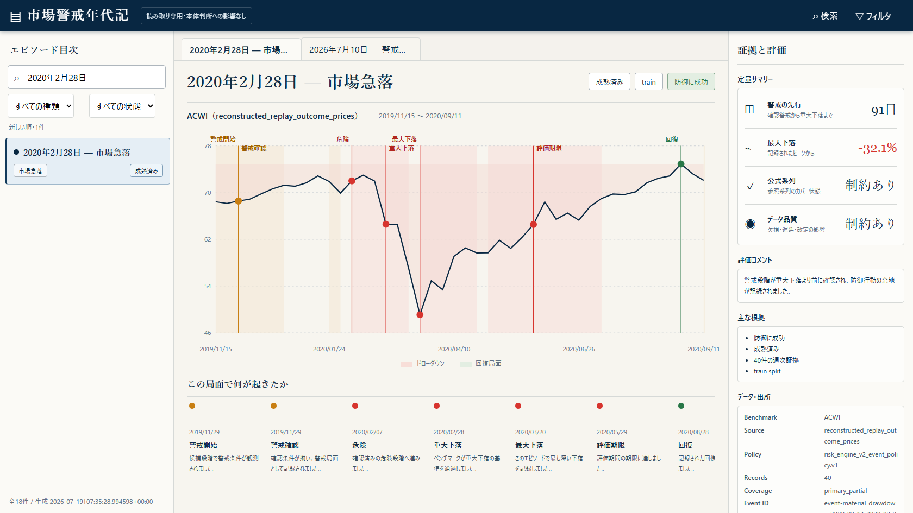

# Global Market Monitor

Global Market Monitor は、株式、債券、為替、コモディティなどの市場データをまとめ、毎週の市場状態をHTMLレポートで確認するためのPythonアプリです。

「今の市場で何を確認すべきか」を整理し、感覚だけで判断を急がないための材料を見やすくします。将来の値動きを予測したり、売買を指示したりするアプリではありません。



## できること

- 株式、セクター、債券、信用、為替、コモディティの市場データをまとめて取得する
- 市場全体の状態、危険ライン、データ品質を同じレポートで確認する
- 日本円から投資する場合の為替影響や、外貨資産の円建てリスクを見る
- データ不足や取得失敗を、正常な状態や「警戒なし」と混同しないよう表示する
- 補足ダッシュボードで履歴、判定理由、市場監視、監査情報を詳しく確認する
- 過去の警戒局面を「市場警戒年代記」として、チャートと根拠から読み返す

## v0.11.0の主な変更点

v0.11.0は、最新レポートと補足ダッシュボードの情報量を保ったまま、視線の流れと画面幅への追従を改善するリリースです。

- 広い画面では最新レポートと補足要約を並べ、収まらない幅では補足を下段へ回します
- モバイルでは1列表示へ切り替え、既存の確認項目を削らずに読み進められます
- セクター概要へ4象限図を戻し、2週間前・先週・現在の位置と2本の移動軌跡を表示します
- 相対モメンタムをセクター概要の右上へ配置し、セクター別の横棒をその下に整理しました
- 市場警戒年代記は保存済みの全エピソードを常時閲覧でき、根拠不足や期限切れは更新だけを停止します
- CIの権限を読み取り専用へ限定し、外部Actionを検証済みコミットへ固定しました
- 生成HTMLへ埋め込むデータとメタデータのエスケープを強化しました

最終判断のロジック、買い候補度、しきい値、売買方針は変更していません。Risk Engine V2とSQLite保存は、引き続きshadow・照合用途です。

## はじめ方

### 必要なもの

- Windows
- Python 3.11以上
- 実データを取得する場合はインターネット接続

### 1. ライブラリを入れる

```powershell
python -m pip install -r project/requirements.txt
```

同じ環境をできるだけ再現したい場合は、固定版も利用できます。

```powershell
python -m pip install -r project/requirements-lock.txt
```

### 2. 起動する

Windowsでは、リポジトリ直下のバッチファイルを使うのが簡単です。

```powershell
.\run_main.bat
```

表示されたメニューで操作を選びます。

- `[1]` 市場データを取得し、レポートを生成して開く
- `[2]` 保存済みの履歴を開く
- `[3]` 終了する

Pythonから直接実行することもできます。

```powershell
python project/main.py
```

画面と処理の流れだけを確認する場合は、サンプルデータを使えます。

```powershell
python project/main.py --sample-only
```

`--sample-only`は実データによる市場判断ではありません。このモードの結果を投資判断に使わないでください。

## 実行後に作られるもの

通常実行が完了すると、主に次のHTMLが`project/reports/`へ生成されます。

| ファイル | 内容 |
|---|---|
| `report.html` | 最新の市場状態と、最初に確認する要点 |
| `supplement_dashboard.html` | 判定理由、データ制約、市場監視、監査の詳細 |
| `dashboard.html` | 過去の実行履歴 |
| `risk_engine_v2_episode_chronicle.html` | 過去の警戒局面を読む市場警戒年代記 |

生成済みレポートは利用者のPC内だけに保存され、公開リポジトリには含まれません。

## レポートの見方

### 最新レポート

`report.html`は、現在の市場状態を短時間で確認する入口です。市場全体の評価、データ品質、危険ライン、追加確認が必要な理由を最初に見ます。

### 補足ダッシュボード

`supplement_dashboard.html`は、最新レポートの結論を詳しく確認する画面です。日本居住者向けの為替・国内市場文脈、Hindenburg Omen、市場データ、候補証拠などを確認できます。

### 市場警戒年代記

市場警戒年代記は、過去に検出した警戒局面や市場急落を、ひとつずつ時系列で確認する読み取り専用画面です。

各エピソードには、次の情報をまとめています。

- 警戒前後の価格チャート
- 当時の警戒判断に関連した指標
- 警戒開始、危険化、結果確認、回復などの時系列
- 評価期間が終わった後の判定
- 使用したデータ、鮮度、取得元、制約

年代記は過去の診断を読み返すための機能です。現在の`final_action`や買い候補度を変更しません。必要な根拠が不足、不整合、期限切れの場合は新しいエピソードへの更新を停止し、その理由を表示します。保存済みの有効なエピソードは公開日数で非表示にせず、いつでも読み返せます。

## ローカルデータとSQLite保存

市場データ、レポート、履歴は利用者のPC内に保存されます。SQLiteはアプリ内部の保存部品として使うため、SQLやデータベース操作を行う必要はありません。

現在のSQLite移行は照合段階です。

- 検証済みCSVからSQLiteへ初回移行する
- CSVとSQLiteの系列、日付、値、欠損を完全照合する
- 同じ入力の再実行ではデータを増やさない
- 既存の無関係なDBや競合した保存先を上書きしない
- 既存CSVは削除せず、通常の読み取りにも引き続き使用する

SQLiteを唯一の保存先にする変更、古いデータの自動削除、保存期間の短縮はまだ有効にしていません。

## データ品質と判断の境界

このアプリは、データ品質が低い日に強い判断を出さないことを重視しています。

- サンプルデータだけの実行は診断用として扱う
- 重要系列の欠損やsample fallbackがある日は判断を安全側へ制限する
- Hindenburg Omenは表示専用で、単独で売買判断に使わない
- `buy_window`と`buy_candidate`は確認候補であり、購入指示ではない
- `buy_readiness_score`は成功確率や期待リターンではない
- Risk Engine V2は`shadow`、`diagnostic_only_not_promoted`のまま運用する

正式判断は既存の`final_action`とデータ品質ポリシーに従います。診断機能や過去検証がproduction判断を上書きすることはありません。

## Hindenburg Omenの手動データ

自動取得できない場合は、空のCSV作成、外部CSVの整形、1日分の手入力を利用できます。

```powershell
python -m project.hindenburg_manual create-template --output project/manual_sources/hindenburg_breadth.csv
python -m project.hindenburg_manual normalize-csv --input path/to/source.csv --output project/manual_sources/hindenburg_breadth.csv
```

詳しい手順は[データ取得ガイド](docs/hindenburg_omen_data_acquisition.md)と[手動入力ガイド](docs/hindenburg_omen_manual_input.md)を参照してください。

## 開発・公開前の確認

開発用ツールを入れる場合は次を使います。

```powershell
python -m pip install -r project/requirements-dev.txt
```

主な確認コマンドは次のとおりです。

```powershell
python -m pytest
python -m ruff check .
python -m black --check .
python -m mypy .
.\scripts\security_audit.ps1 -ExpectedTag "" -Strict
python scripts/create_release_package.py --dry-run
```

公開前の完全な手順は[GitHub公開チェックリスト](docs/github_publish_readiness_checklist.md)にまとめています。

## 公開版に含めないもの

ソース配布には、次のローカルデータを含めません。

- 取得済みの市場キャッシュ
- SQLiteデータベース
- 生成済みHTML・Markdownレポート
- 実行ログと一時ファイル
- 手動入力した市場データ
- 個人用メモ、認証情報、秘密情報

公開用アーカイブは追跡済みソースだけから作成し、除外対象が混入していないことをmanifestで検証します。

## 詳しい説明

- [詳細なセットアップと機能説明](project/README.md)
- [検証結果の読み方と限界](docs/validation_limits.md)
- [Risk Engine V2の現在状態](docs/risk_engine_v2_current_state.md)
- [変更履歴](CHANGELOG.md)

## 利用条件

本ソフトウェアは、個人による私的かつ非商用の実行に限って利用できます。商用利用、ソースコードの改変、再配布、第三者へのサービス提供は許可していません。本ソフトウェアはオープンソースではありません。

詳しい条件、無保証、責任制限は[LICENSE](LICENSE)を確認してください。GitHubの公開機能に伴う閲覧・forkの扱いと、第三者ライブラリのライセンスはそれぞれの条件に従います。

## 注意

このソフトウェアと生成レポートは、投資助言、売買指示、利益保証を目的としたものではありません。最終的な投資判断は、利用者自身の責任で行ってください。
